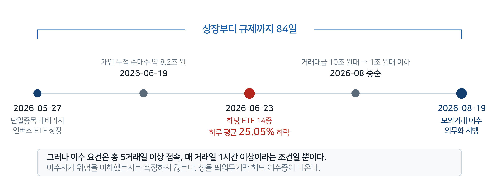
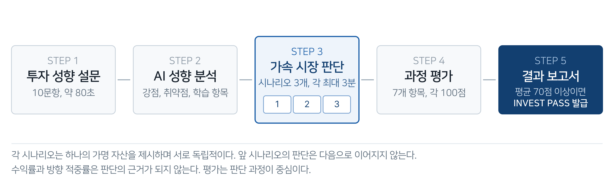
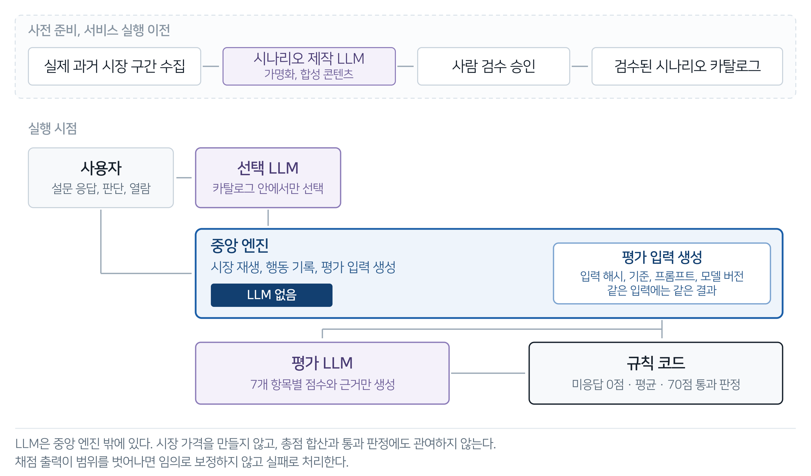

# 제출본 원고 공모전 기획서

| | |
|---|---|
| 팀명 | 청산노노 |
| 구성원 성명 | 박상현(팀장), 김민기, 김인근, 이이삭 |

---

## 1. 서비스 명칭

**청산노노**

*AI 기반 레버리지 모의투자 교육 플랫폼*

레버리지 상품을 실제로 매매하기 전에 고위험 상황을 먼저 겪고, 그때 내린 판단 과정으로 훈련과 평가를 받는 서비스다. 레버리지 상품을 이용할 때 이에 대한 위험성을 이해하고 안전하게 투자하는 법을 훈련시킨다.

평가를 통과한 사용자에게는 자체 교육 인증 "INVEST PASS"를 발급한다. 공인 금융 자격은 아니며, 이 점을 인증서와 화면에 명시한다. 발급받은 인증을 제3자가 조회할 수 있는 공개 검증 페이지는 추후 제공할 예정이다.

---

## 2. 아이디어 기획 핵심내용

**한 줄 정의**

실제로 있었던 고위험 시장 구간을 종목명, 날짜, 가격까지 모두 가린 후 실제 시간 흐름보다 빠르게 재현해, 사용자의 투자 의사결정 과정을 평가하고 교육 인증을 발급하는 AI 기반 모의투자 교육 플랫폼이다.

**문제**

2026년 8월 19일부터 단일종목 레버리지 상품에 처음 투자하려면 한국거래소 모의거래인증시스템에서 모의거래를 이수해야 한다. 그러나 이 요건은 총 5거래일 이상 접속하고 매 거래일 1시간 이상 거래하는 시간 조건일 뿐, 이수자가 위험을 이해했는지는 측정하지 않는다. 이수증은 발급되지만 이수자가 제대로 이해했는지와 같은 학습 이수 수준은 검증되지 않는다.

*출처: 한국거래소 단일종목 레버리지·인버스 모의거래 의무 이수 요건 (2026-08-19 시행)*

**해결 방안**

표 2-1. 서비스 진행 4단계

| 단계 | 내용 |
|---|---|
| 1. 성향 분석 | 투자 경험, 위험 선호, 레버리지 이해도, 정보 검증 습관 등 10개의 온보딩 투자 성향 문항에 이용자가 답하면 AI가 강점과 취약점, 우선 학습 항목을 정리한다. |
| 2. 맞춤 시나리오 배정 | AI가 사전에 검수된 시나리오 중에서 사용자에게 필요한 시나리오를 고른다. 시나리오는 실제 과거 시장을 기반으로 하되 종목, 기업, 인물, 날짜, 뉴스 원문, 절대 가격을 모두 가명화하고 가격을 정규화한다. |
| 3. 가속 시장 판단 | 시장이 실제 시간보다 60배 빠르게 흐르는 동안 공시, 기사, 커뮤니티 글이 순차로 등장한다. 사용자는 세 개의 독립된 투자 시나리오에서 각각 UP 또는 DOWN을 고르고, 판단 근거와 확신도를 함께 남긴다. |
| 4. 과정 평가와 인증 | 위험 신호 인식, 정보 출처 구분, 판단과 근거의 일관성 등 7개 항목을 시나리오마다 채점하고, 세 시나리오 점수 평균이 70점 이상이면 "INVEST PASS"를 발급한다. |

**설계 원칙**

표 2-2. 설계 원칙 세 가지

| 원칙 | 내용 |
|---|---|
| AI로 직접 시장을 만들지 않는다. | 준비된 시나리오의 가격과 거래량은 실제 기록을 바탕으로 하며, AI는 성향 분석, 시나리오 선택, 콘텐츠 각색, 판단 해석만 맡는다. |
| 수익률과 방향 적중률은 채점 근거로 삼지 않는다. | 수익률이 높은가, 방향을 맞혔는가에 주목하는 것이 아니라 어떻게 판단했는지를 본다. |
| 총점 합산과 통과 판정은 규칙 코드가 수행한다. | 같은 기록에는 같은 결과가 나오게 구성이 되어 있다. |

**차별성**

기존 모의투자가 실전 주문 화면에 익숙해지는 리허설을 제공하는 곳이라면, 청산노노는 실전에서 경험할 수 있는 고위험 상품 투자의 위험성을 체험해보고 투자를 할 기본적인 준비가 되어 있는지 진단받는 곳이다.

**활용처**

표 2-3. 적용 대상

| 구분 | 대상 |
|---|---|
| B2C | 고위험 상품에 처음 투자하는 개인투자자 |
| B2B | 증권사 및 거래소의 투자자보호 이수 프로그램 |
| B2G | 학교 및 기관 금융교육 |

---

## 3. 문제 정의 및 제안 배경

### 3.1 배경: 규제가 상품을 따라잡는 데 84일이 걸렸다

도식 3-1. 단일종목 레버리지 상장부터 이수 의무화까지 84일

상장 종목은 삼성전자와 SK하이닉스를 기초자산으로 하는 단일종목 레버리지·인버스(2×) ETF다.

같은 기간 국내 금융소비자의 디지털 금융이해력은 59.3점으로 OECD 목표(70점)를 밑돌았고, 목표 점수를 넘긴 고이해력 집단은 28.2%에 그쳐 조사 대상의 70% 이상이 저이해력 집단에 속했다. 같은 조사는 카드, 금융투자, 보험 등 금융서비스를 이용해 본 경험이 이해력 점수를 2.2점에서 3.5점까지 끌어올리는 요인이라고 보고한다. 결국 직접 경험이 금융서비스에 대한 이해를 만든다는 것이다. 그러나 그 경험을 실제 자산으로 사게 하는 것은 대가가 너무 크다.

*출처: 한국금융소비자보호재단 「2025년 디지털 금융이용실태 조사」*

### 3.2 문제 정의

**첫째, 고위험 상품에 대한 투자 위험성과 투자자의 이해 사이에는 격차가 존재한다.**

레버리지 상품이나 인버스 상품은 일간 수익률의 배수를 추종하기 때문에 횡보장에서도 원금이 줄어드는 구조다. 이러한 구조는 글로는 거의 전달되지 않는다. 실제로 겪어야 이해되는 위험이기 때문이다.

**둘째, 이수 제도는 이수 유무만 확인하고 실제 이해도는 측정하지 못한다.**

표 3-1. 현행 이수 요건이 측정하는 것과 측정하지 않는 것

| 현행 요건 | 측정하는 것 | 측정하지 않는 것 |
|---|---|---|
| 총 5거래일 이상 접속, 거래 | 접속 일수 | 손실 상황에서의 의사결정 |
| 매 거래일 1시간 이상 | 체류 시간 | 위험 개념의 이해 여부 |
| HTS 설치 후 정규장, Replay장 이용 | 주문 실행 능력 | 왜 그 주문을 냈는지 |

*출처: 한국거래소 모의거래인증시스템 이수 요건*

결국, 현재의 이수 제도는 창을 띄워두기만 해도 이수증이 나온다. 제도의 취지와 실제 운영 사이에 공백이 존재한다.

**셋째, 기존 모의투자 서비스는 이용자들의 이상적인 학습 환경을 만들지 못한다.**

표 3-2. 기존 모의투자 서비스의 한계

| 한계 | 결과 |
|---|---|
| 실제 종목명과 날짜를 그대로 노출한다. | 어떤 구간인지 아는 순간 정답을 검색할 수 있다. |
| 수익률 순위로 평가한다. | 운을 전제로 과격한 투자를 진행한 사람이 높은 순위를 차지한다. 잘못된 행동이 강화된다. |
| 모두에게 같은 시나리오를 준다. | 개개인의 취약점을 겨냥하지 못한다. |
| 이수 후 피드백이 없다. | 무엇을 왜 잘못했는지 모른 채 끝난다. |
| 진입 장벽이 높다. | HTS 설치와 복잡한 주문 화면이 학습 이전에 이탈을 만든다. |

### 3.3 특정 금융 고객과 선택 배경

**1차 고객: 고위험 상품에 처음 진입하려는 개인 일반투자자**

레버리지, 인버스처럼 손실 구조가 다른 상품을 처음 다루는 순간이 가장 위험하고, 이수 의무화가 겨냥한 지점도 거기다.

표 3-3. 1차 고객 선택 근거

| 근거 | 설명 |
|---|---|
| 제도가 만든 수요 | 2026년 8월 19일 이수 의무화의 법적 대상자와 정확히 일치한다. 제도로 인한 수요가 이미 존재한다. |
| 학습 효율 | 투자 경험이 짧아 고위험 상품 투자 경험의 학습 효율이 가장 높은 집단이다. |
| 대회 주제와의 정합 | 신규 진입자의 다수는 20~30대이므로 대회 세부 주제 예시 중 "청년층 자산 형성을 위한 AI 기반 포용적 금융서비스"에 잘 맞는다. |

**2차 고객(B2B): 증권사와 거래소의 투자자보호, 교육 담당 부서**

투자 이수 프로그램을 운영해야 하지만 투자 역량을 제대로 측정할 수단이 없는 주체다.

### 3.4 배포 채널과 선택 배경

**모바일 웹 우선, 데스크톱 반응형**

표 3-4. 채널 선택 근거

| 근거 | 설명 |
|---|---|
| 제도와 현실의 불일치 해소 | 현행 KRX 모의거래는 HTS 전용이며 모바일에서는 쓸 수 없다. 그러나 개인투자자의 실제 거래는 모바일 비중이 늘어나는 추세다. 학습한 채널과 실제 거래하는 채널이 같아야 학습 내용이 효과적으로 적용된다. |
| 진입 마찰 최소화 | 설치나 인증서 없이 서비스 주소를 통해 바로 들어올 수 있다. 매매 주문 대신 UP/DOWN 두 가지만 고르면 되므로 투자 경험이 없어도 바로 참여할 수 있다. |

---

## 4. 서비스 컨셉 및 차별성

### 4.1 컨셉: 실제 있었던 큰 변동성을 모르는 상태로 다시 체험한다

도식 4-1. 서비스 흐름

**투자 성향 분석**

투자 경험, 위험 선호, 레버리지 이해도, 손실 대응 성향, 정보 검증 습관, 관심 자산, 감수 가능한 변동 수준 등 10개 문항에 답하면 AI가 성향 요약과 강점, 취약점, 우선 학습 항목을 정리하고 적합한 시나리오를 고른다.

**맞춤 시나리오 배정**

AI는 사전에 검수된 시나리오 목록 안에서만 배정한다. 각 시나리오는 실제 과거 시장 구간을 기반으로 제작하되 종목명, 기업명, 인물명, 날짜, 뉴스 제목과 본문, 절대 가격을 모두 가명화하고 가격을 시작 시점 기준으로 정규화한다.

평가는 서로 독립된 세 개의 시나리오로 구성되며, 각 시나리오는 하나의 가명 자산과 그 시점의 시장을 제시한다. 한 번에 하나만 공개되고 앞 시나리오의 판단은 다음 시나리오로 이어지지 않는다.

참고로, 이번 PoC 시나리오에는 레버리지, 인버스 상품을 포함하지 않는다. 레버리지 위험의 본질인 고변동 구간에서의 판단을 일반 자산으로 먼저 훈련시키고, 레버리지 상품은 상품 유형과 배수를 명시하는 시나리오 확장 이후 편입한다.

**가속 시장과 판단 기록**

시장은 실제 시간의 60배속으로 흐른다. 시나리오의 캔들과 정보는 평가를 시작할 때 한 번에 전달되고, 시간의 흐름과 정보 공개는 화면에서 진행된다. 각 시나리오의 제한 시간은 최대 3분이며, 세 시나리오를 합쳐 최대 9분이다. 다만 이번 PoC에서는 진행 중 화면을 새로 고치면 그때까지의 진행이 유지되지 않는다.

각 시나리오에서 최소 한 번 이상은 판단해야 하며, 제한 시간 동안 UP/DOWN을 수시로 다시 제출할 수 있다. 재제출은 이전 응답을 덮어쓰지 않는다. 같은 방향의 재확인도, 방향을 바꾼 후속 판단도 각각 별개의 판단 이벤트로 시간순으로 쌓인다. 판단 이벤트가 한 건이라도 있는 시나리오는 채점 가능 상태가 되고, 시나리오가 끝날 때 채점 대상으로 확정된다. 한 건의 응답도 없이 끝난 시나리오는 0점으로 처리된다. 채점 가능 상태이면 제한 시간 전에 다음 시나리오로 넘어갈 수 있고, 언제든 시험을 조기 종료할 수도 있다. 두 행위 모두 감점은 없다.

모든 판단 이벤트는 다음과 함께 기록된다.

표 4-1. 판단 이벤트와 함께 남는 기록

| 구분 | 기록 내용 |
|---|---|
| 판단 | 시나리오 순서, 가명 자산, UP/DOWN 방향, 확신도, 판단 근거 태그, 직접 입력한 사유, 시작 이후 경과 시간과 시장 시점, 당시 정규화 가격 |
| 정보 노출과 열람 | 뉴스 목록이 화면에 나타난 사실과 사용자가 상세 본문을 실제로 연 사실을 구분해 기록한다. |

판단과 열람 기록에는 세션 전체에 걸쳐 이어지는 순번을 부여한다. 두 기록을 순번으로 합치면 판단 → 열람 → 판단의 행동 순서를 그대로 복원할 수 있고, 채점은 이 복원된 타임라인 위에서 이루어진다.

**과정 평가**

평가에서 말하는 판단의 효용은 가격을 맞혔는지가 아니다. 각 판단 당시 이용 가능했던 제한된 정보에서 근거를 고르고 확신도를 표현하며, 시간에 따른 판단, 근거, 확신도의 변화가 새 정보와 시장 흐름에 비추어 이용자의 생각이 반영된 과정인지를 본다. 여러 번 눌렀다거나 방향을 바꿨다는 것 자체는 정답도 오답도 아니다.

답변한 시나리오마다 100점 만점으로 다음을 평가한다.

표 4-2. 평가 항목과 배점

| 평가 항목 | 배점 | 판단 증거 |
|---|---:|---|
| 위험 신호 인식과 대응 | 20 | 변동성·거래량·뉴스의 위험 신호를 근거에 반영했는지 |
| 불확실성과 변동성 인식 | 15 | 정보의 불확실성과 가격 변동성을 태그와 확신도에 반영했는지 |
| 정보 활용과 출처 구분 | 15 | 시나리오 설명과 뉴스의 역할을 구분하고 필요한 상세 정보를 열람했는지 |
| 시장 흐름 해석 | 15 | 당시 공개된 캔들, 거래량, 사건을 판단과 연결했는지 |
| 초기 성향과 응답의 정합성 | 15 | 설문에서 밝힌 성향과 실제 응답이 어떻게 이어지는지 |
| 판단·확신도·근거의 일관성 | 10 | 각 시점의 방향, 확신도, 근거가 서로 부합하고, 후속 판단의 변화가 새 정보나 시장 흐름과 일관되게 연결되는지 |
| 판단 근거의 유용성 | 10 | 고른 근거가 실제 의사결정에 유용하고 서로 모순되지 않는지 |
| 합계 | 100 | |

최종 점수는 세 시나리오의 평균이며, 반올림 전 70점 이상이면 통과한다. 미응답 시나리오는 0점으로 처리하며, 이 판정은 규칙 코드가 수행한다. 항목 점수는 LLM이 생성하되 범위와 합계는 코드가 검증하며, 출력이 누락되거나 범위를 벗어나면 임의로 보정하지 않고 실패로 처리한다.

채점 기준은 사전에 공개한다. 평가를 시작하기 전에 위 항목과 배점을 안내해, 사용자가 수익률이 아니라 판단 과정이 평가된다는 것을 알고 시작하도록 한다. 채점 기준은 버전 태그와 함께 관리되며 평가 결과에 함께 기록된다.

### 4.2 기존 금융 앱 대비 차별성

표 4-3. 기존 서비스와의 차별성

| # | 차별성 | 기존 서비스 | 청산노노 |
|---|---|---|---|
| 1 | 가명화, 정규화된 실제 시장 | 실제 종목명과 날짜를 그대로 노출해 검색으로 결과를 확인할 수 있다. | 종목, 기업, 인물, 날짜, 뉴스 원문, 절대 가격을 모두 가리고 가격을 정규화한다. 검색 단서가 남지 않으면서 실제 사건의 인과 구조는 보존되어, 합성 데이터보다 더 효율적인 학습이 가능하다. |
| 2 | 과정 채점과 통과 기준 | 수익률 순위 중심이라 과격한 투자 성향이 유리해진다. | 7개 항목 100점, 세 시나리오 평균 70점 통과. 수익률과 방향 적중률은 아예 평가 기준으로 삼지 않으므로 과격한 투자 성향이나 운으로 통과할 수 없다. |
| 3 | 맞춤 시나리오 배정 | 모두에게 같은 시나리오 | 성향 분석 결과로 약점을 겨냥한 구간을 검수된 시나리오 목록에서 배정한다. |
| 4 | 판단, 확신도, 근거를 함께 기록하고 대조 | 결과만 기록 | 방향, 확신도, 근거를 필수로 남기고 뉴스가 화면에 노출된 사실과 실제로 열어본 사실을 구분해 기록한다. 자기 인식과 실제 행동의 차이 자체를 진단한다. |
| 5 | AI 결과 보고서와 교육 인증 | 피드백 없음, 시간 기반 이수 | 평가 결과 보고서와 INVEST PASS로 시간 기반 이수 제도의 형식성을 역량 기반으로 보완한다. |

### 4.3 지양하는 것

표 4-4. 서비스가 하지 않는 것

| 영역 | 내용 |
|---|---|
| 투자 자문 | 실제 종목에 대한 투자 자문, 추천, 수익률 예측을 하지 않는다. |
| 실거래 | 실제 주문 체결이나 자금 이동이 없다. |
| 순위 경쟁 | 수익률 순위표를 만들지 않는다. 투자가 도박화되는 것을 막는다. |
| 자유 생성 | AI가 시장 가격이나 시나리오를 자유롭게 생성하지 않는다. |

---

## 5. 활용 데이터 및 생성형 AI 모델 적용 방안

### 5.1 활용 데이터

표 5-1. 활용 데이터의 종류와 수집·활용 방안

| 구분 | 데이터 | 수집 및 가공 | 활용 |
|---|---|---|---|
| 시장 기록 | 1분봉 시가, 고가, 저가, 종가, 거래량 | 공개 아카이브에서 실제 과거 구간을 수집하고, 행 수와 시간축, 정합성, 해시를 검증한다. | 시나리오의 원본. AI가 생성하지 않고 그대로 활용한다. |
| 뉴스, 공시 | 원 제목, 정확한 시각, 출처, 독자적으로 작성한 사실 요약 | 원문 전문은 저장하지 않는다. | 가명 합성 콘텐츠의 사실 기반 |
| 가명화 매핑 | 가상 자산명, 티커, 인물명, 날짜 치환표, 가격 정규화 정책 | 시나리오 제작 시 생성 후 사람이 검수해 승인한다. | 실존 정보 노출 차단 |
| 시나리오 목록 | 시나리오 정의, 사건 타임라인, 평가 규칙 | 사람이 사전 검수해 고정한다. | AI는 이 안에서만 선택한다. |
| 성향 응답 | 투자 경험, 위험 선호, 레버리지 이해도, 정보 검증 습관, 감수 가능 변동 수준 등 10문항 | 온보딩 설문 | 시나리오 배정, 결과 해석 |
| 판단 기록 | 방향, 확신도, 근거 태그와 직접 입력, 시각, 당시 가격, 열람한 정보와 출처 | 서비스가 직접 생성 | 과정 평가, 결과 보고서 |

**데이터 선택 근거**

학습의 소재는 자산군이 아니라 상황이다. 사용자에게는 종목명, 티커, 날짜, 절대 가격이 모두 가려진 채 제시되므로 원본이 어떤 시장이었는지는 드러나지 않는다. 선택 기준은 세 가지이다.

표 5-2. 시장 구간 선택 기준

| 기준 | 이유 |
|---|---|
| 변동성 높은 구간이 실재할 것 | 급락, 급등, 유동성 증발처럼 판단이 시험되는 상황이 실제로 일어난 구간이어야 효율적인 학습이 가능하다. |
| 1분 단위 연속 데이터일 것 | 빠른 시간 흐름 내에서 고정 판정 구간을 만들려면 조밀한 시계열이 필요하다. |
| 공개 아카이브이고 이용 조건이 분명할 것 | 재수집과 검증이 가능해야 한다. |

수집한 구간은 거시 충격, 규제와 공시 사건, 유동성 위기, 허위 정보 유포 등 서로 다른 유형으로 구성했다. 평가 항목인 정보 출처 구분과 급변 대응을 각각 다른 방식으로 시험하기 위해서다. 학습되는 역량은 자산군에 매이지 않으므로, 국내 주식이나 레버리지 상품 구간을 추가할 때도 같은 구조로 편입된다.

**개인정보 처리**

표 5-3. 개인정보 처리 방침

| 구분 | 내용 |
|---|---|
| 수집하지 않는 정보 | 실명, 주민번호, 계좌번호, 실제 보유 종목, 실제 자산 규모를 일절 수집하지 않는다. |
| 로그인 | 익명 세션을 사용한다. |
| 판단 기록의 성격 | 서비스 안에서 생성된 가상의 판단이므로 금융거래정보에 해당하지 않는다. |
| 유출 시 영향 | 민감정보를 다루지 않으며, 유출되더라도 금융 피해가 성립하지 않는 데이터 구조다. |

### 5.2 생성형 AI 적용 방안

표 5-4. AI가 수행하는 역할

| 역할 | 입력 | 출력 | 왜 이 방식이어야 하는가 |
|---|---|---|---|
| 성향 분석 | 10문항 응답 | 성향 요약, 강점, 취약점, 우선 학습 항목 | 응답 사이의 모순을 짚어내는 일은 규칙으로 열거하기 어렵다. |
| 시나리오 선택 | 성향 프로파일, 검수된 시나리오 목록 | 시나리오 선택과 배정 근거 | 취약점과 시나리오 특성의 의미적 연결. 다만 규정된 시나리오 목록 밖으로는 나가지 않는다. |
| 콘텐츠 각색 | 시나리오에 정의된 사실, 진행 시점 | 공시, 기사, 커뮤니티 글 | 같은 사건을 출처별로 다른 어조와 신뢰도로 재구성해야 정보 출처 구분을 평가할 재료가 생긴다. 실시간 생성이 아니라 사전에 일괄 생성해 두고 검수한 뒤 재생한다. |
| 판단 해석 | 전체 판단 기록, 정보 열람 이력 | 판단 시점과 방향 변경 패턴, 당시 노출된 정보에 근거한 판단 이유 추정 | 행동에서 의도를 역추정해야 한다. |
| 항목 채점 | 봉인된 평가 입력 | 항목별 점수와 근거 | 정성적 판단을 근거와 함께 서술해야 한다. |
| 결과 보고서 | 항목 점수와 판단 기록 | 자연어 보고서 | 정량 지표를 개인의 언어로 설명해야 행동이 바뀐다. |

**AI가 하지 않는 것**

표 5-5. AI가 관여하지 않는 영역

| 영역 | 처리 주체 |
|---|---|
| 캔들과 시장 데이터 생성 | 실제 기록 재생 |
| 시장 시간 진행 | 서버 스케줄러 |
| 총점 합산, 평균, 통과 판정 | 규칙 코드 |
| 미응답 시나리오 0점 적용 | 규칙 코드 |

**시스템 경계**

도식 5-1. LLM과 중앙 엔진의 경계

**콘텐츠 생성 원칙**

표 5-6. 콘텐츠 생성 원칙

| 구분 | 원칙 |
|---|---|
| 실존 정보 차단 | 실존 기업, 인물, 종목명을 쓰지 않는다. |
| 원문 비복제 | 실제 뉴스 원문을 복사하지 않는다. |
| 사실 범위 | 시나리오에 정의된 사실만 사용한다. |
| 시점 제약 | 시나리오상 미래 정보는 모르는 채로, 현재 진행 상황만 근거로 생성한다. |
| 가명 일관성 | 같은 시나리오 안에서 가명을 일관되게 유지한다. |
| 생성물 고지 | 모든 콘텐츠에 AI 생성 시뮬레이션 콘텐츠임을 표시한다. |
| 투자 권유 금지 | 투자 추천 문구를 생성하지 않는다. |

**재현성**

평가 입력을 정규화해 해시로 변환하고, 입력 해시와 채점 기준, 프롬프트, 모델 버전을 함께 보존한다. 같은 조건의 재요청에는 저장된 같은 결과를 반환한다.

---

## 6. 기대 효과 및 확장 가능성

### 6.1 해결하는 문제와 기대 효과

표 6-1. 대상별 기대 효과

| 대상 | 기대 효과 |
|---|---|
| 개인투자자 | 실제 자산의 손실 없이 급변 구간에서의 투자 판단 경험을 할 수 있다. 자신의 판단 습관을 점수와 근거로 되돌아볼 수 있다. |
| 증권사, 거래소 | 시간 기반 이수제를 역량 기반으로 보완할 측정 도구를 갖게 된다. 투자자보호 의무 이행이 실질화된다. |
| 감독 당국 | 이수자의 집계 행동 데이터로 어떤 개념이 실제로 이해되지 않는지 파악할 수 있는 기준을 세울 수 있게 된다. |
| 학교, 기관 | 교사가 시나리오를 골라 배포하는 금융교육 교보재로 쓸 수 있다. |

### 6.2 효과 측정

청산노노는 모든 판단을 기록하므로 교육 효과를 서비스 자체가 측정한다. 별도 조사 없이 다음 지표가 쌓인다. 단, 이번 PoC는 평가 기록을 서버에 보관하지 않으므로 회차 누적이 필요한 지표는 측정 설계로만 제시한다.

표 6-2. 서비스가 자체 산출하는 효과 지표

| 지표 | 산출 | 무엇을 증명하는가 |
|---|---|---|
| 총점 향상폭 | 같은 사용자의 회차별 총점 | 반복 훈련의 학습 효과 |
| 정보 열람 행동 변화 | 공시 열람 비율, 아무것도 열지 않은 판단의 비율 | 행동 변화의 직접 증거 |
| 성향과 응답의 정합 개선 | 선언한 성향과 실제 판단의 간격 축소 | 자기 인식의 정확도 |
| 완주율과 통과율 | 세션 기록 | 형식적 이수율 대비 실질 통과율 |

현행 이수 제도는 접속 시간만 기록하므로 이수자가 무엇을 이해하지 못하는지 알 수 없다. 청산노노는 그 질문에 답할 수 있는 첫 측정 도구가 될 수 있다.

### 6.3 확장 가능성

**규제 이수 시장으로의 확장 · 가장 유력한 사업화 경로**

KRX는 파생상품, 개인 공매도, 단일종목 레버리지 순으로 같은 구조의 모의거래 이수제를 확장해 왔다. 고위험 상품이 나올 때마다 이수 의무화가 뒤따르는 패턴이 반복돼 왔고, 상품이 늘어날 때마다 청산노노가 다룰 시장도 넓어진다.

**레버리지 상품 편입 · 가장 가까운 후속 개발**

PoC는 변동성이 높은 구간에서의 판단 능력을 일반 자산으로 먼저 훈련시킨다. 다음 단계는 시나리오에 레버리지, 인버스 상품을 넣는 것이다. 그러면 기초자산이 제자리로 돌아온 구간에서 레버리지 상품만 손실이 남는 경험을 직접 겪게 할 수 있고, 레버리지 통제 역량을 자기신고가 아니라 실제 판단 행동으로 측정할 수 있으며, 2026년 8월 19일 이수 의무화 대상 상품과 1대 1로 대응하는 훈련 과정을 제공할 수 있다.

**PoC 이후 실전형 모드**

표 6-3. 판단 모드와 실전형 모드의 차이

| | 판단 모드 (PoC) | 실전형 모드 (후속) |
|---|---|---|
| 액션 | UP/DOWN과 근거 | 매수, 매도, 비중 조절과 손절 |
| 상태 | 포지션, 비중, 손익 없음 | 가상 포지션과 잔고, 손익 |
| 추가 평가 | 없음 | 포지션 사이징, 손절 준수, 자산 집중도, 최대 낙폭 |

**상품군 확장**

시나리오 목록에 구간을 추가하는 것만으로 다룰 상황이 늘어난다. 엔진을 바꿀 필요가 없다.

**금융 외 영역 확장**

같은 구조로 보이스피싱, 스미싱 대응 훈련을 구성할 수 있다. AI가 사기범 역할을 맡고, 사용자의 대응 행동을 평가해 인증을 발급하는 방식이다. 보험 불완전판매 방지 교육, 기업 내 컴플라이언스 훈련으로도 확장할 수 있다.

**데이터 자산화**

가명 판단 기록의 집계 통계는 어떤 금융 개념이 실제로 학습되지 않는지에 대한 국내에서 드문 데이터가 된다.

---

## 7. 책임 있는 AI 설계와 위험 관리

표 7-1. 위험 요인과 대응

| 위험 | 대응 |
|---|---|
| 생성 콘텐츠의 오남용 | 실존 기업, 인물, 종목명 생성을 차단하고, 모든 생성물에 AI 생성 시뮬레이션 콘텐츠임을 상시 표시하며, 외부 공유와 내려받기를 막는다. |
| 가명화 이전 원본의 노출 | 원본 데이터는 실제 자산과 시점, 절대 가격, 출처를 보존하므로 참가자에게 노출되어서는 안 된다. 배포본에는 가명화, 정규화를 거친 패키지만 반영하고 실제 자산과 시점을 추론할 수 있는 정보를 제거한다. |
| 모의투자의 도박화 | 수익률 순위표를 제공하지 않고 사용자 간 수익률 경쟁을 두지 않는다. 과정 점수만 공개한다. |
| 구간 식별 가능성 | 종목, 인물, 날짜, 뉴스 원문, 절대 가격을 모두 가명화하고 시작 가격을 정규화한다. 설령 구간을 알아본다 해도 평가가 방향 적중이 아니라 판단 과정이므로 통과를 조작할 수 없다. |
| 인증의 오해 | 인증서와 화면에 "본 인증은 청산노노가 발급하는 자체 교육 인증이며 공인 금융 자격이나 실제 투자 적격성을 의미하지 않습니다"를 상시 표시한다. 기존 이수제를 대체가 아니라 보완으로 둔다. |
| 채점의 자의성과 재현 불가 | 채점 기준을 사전에 공개하고 불변 버전으로 관리한다. 총점과 통과 판정은 규칙 코드가 수행하며, 평가 결과에 입력 해시와 기준, 프롬프트, 모델 버전을 함께 기록한다. |
| LLM 환각으로 잘못된 금융 지식 전달 | 교육 개념 설명은 사전 검증된 자료에서 인용하고, 생성 콘텐츠는 시나리오에 정의된 사실만 사용한다. 채점 출력이 범위를 벗어나면 보정하지 않고 실패로 처리한다. |
| 개인정보·금융정보 유출 | 실명, 계좌, 실제 보유 종목을 수집하지 않는다. 유출되더라도 금융 피해가 성립하지 않는 구조다. |
