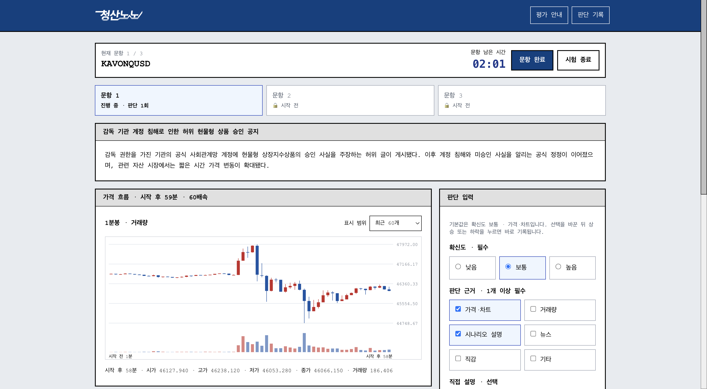
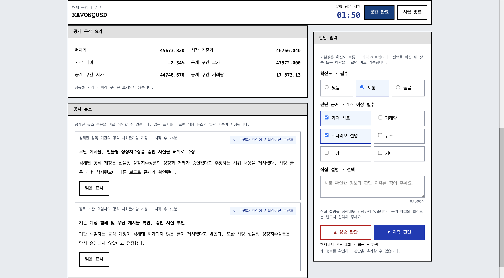
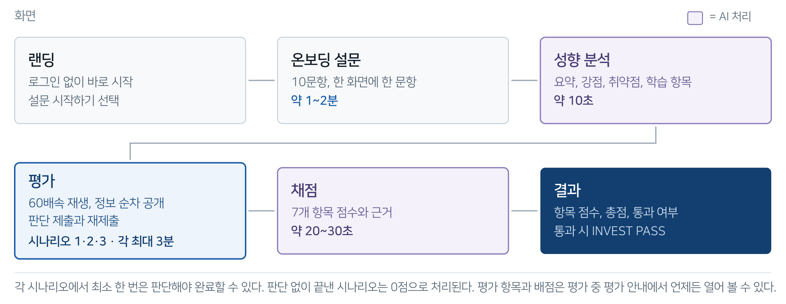
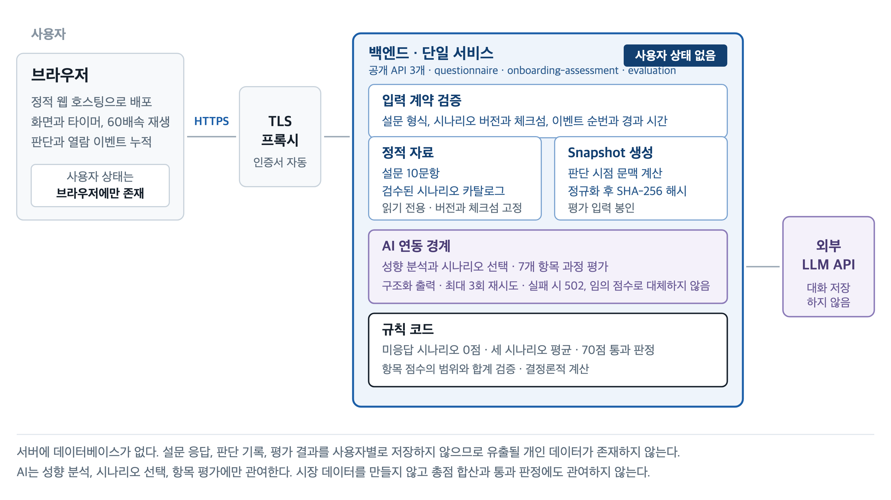
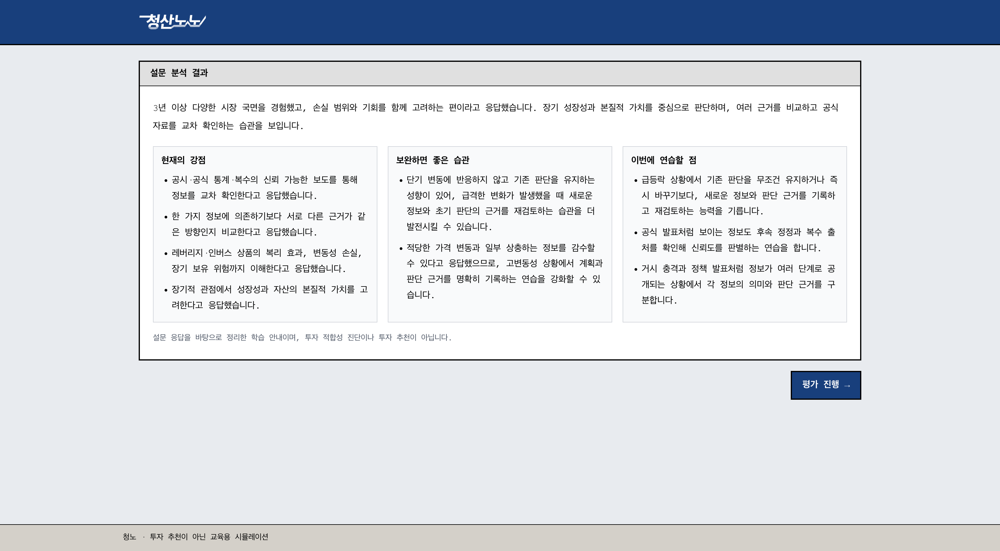
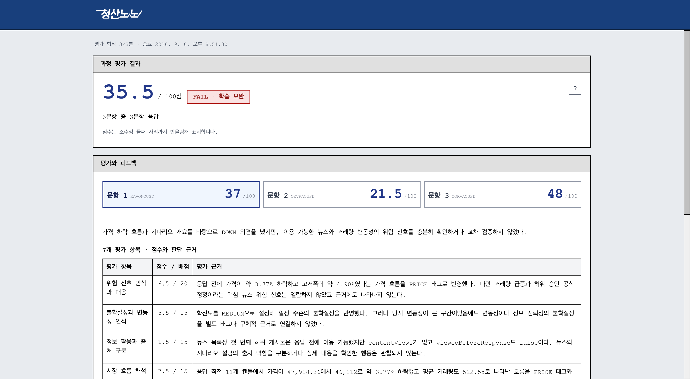

# 제출본 원고 · 첨부2 기능명세서

| | |
|---|---|
| 팀명 | 청산노노 |
| 구성원 성명 | 박상현(팀장), 김민기, 김인근, 이이삭 |
| 웹서비스 URL | https://bluemountainnono.monerujo.ai/ |

---

## 1. MVP 구현 범위

청산노노 MVP는 판단 모드 한 가지를 구현했다. 사용자가 투자 성향 설문에 답하면 AI가 응답을 분석해 성향을 정리하고, 검수된 카탈로그에서 시장 시나리오 세 개를 고른다. 가속 재생되는 시장에서 상승과 하락 판단을 근거, 확신도와 함께 남기면 그 판단 과정을 7개 항목으로 채점해 항목별 점수와 근거, 개선 방향을 제공한다. 세 시나리오 평균이 70점 이상이면 INVEST PASS를 발급한다.

표 1-1. 구현 영역

| 영역 | 구현한 내용 |
|---|---|
| 온보딩 | 투자 성향 설문 10문항, 한 화면에 한 문항 |
| AI 성향 분석 | 응답을 바탕으로 성향 요약, 강점, 취약점, 우선 학습 항목 생성 |
| AI 시나리오 배정 | 검수된 카탈로그에서 사용자에게 맞는 시나리오 세 개 선택 |
| 채점 기준 안내 | 평가 항목과 배점을 시작 전에 공개 |
| 시험 진행 | 독립 시나리오 세 개, 시나리오당 최대 3분, 60배속 시장 재생 |
| 시장 화면 | 정규화 캔들, 거래량, 시나리오 설명, 가명 처리된 뉴스와 공시, 커뮤니티 피드 |
| 판단 기록 | UP/DOWN 방향, 확신도, 판단 근거 태그, 직접 입력, 정보 열람 기록 |
| 진행 제어 | 시나리오 조기 완료, 시험 조기 종료, 시간 만료 자동 종료 |
| AI 과정 평가 | 7개 항목별 점수와 근거 생성, 총점과 통과 여부 판정 |
| 결과 | 항목별 점수와 평가 근거, 개선 방향, 통과 시 INVEST PASS |

표 1-2. 이번 MVP에 넣지 않은 것

| 영역 | 내용 |
|---|---|
| 실거래 연동 | 실제 자금 입출금, 증권사 계좌 연동, 실시간 시세를 다루지 않는다 |
| 주문 기능 | 매수, 매도, 비중 설정, 손절, 공매도, 옵션이 없다 |
| 포지션 계산 | 포지션, 보유량, 잔고, 손익, 최대 낙폭, 자산 집중도를 계산하지 않는다 |
| 경쟁 요소 | 사용자 간 수익률 경쟁과 순위표를 두지 않는다 |
| 상품 범위 | 레버리지와 인버스 상품 시나리오는 다루지 않는다 |

---

## 2. 주요 기능 목록

표 2-1. 주요 기능

| # | 기능명 | 기능 설명 | 관련 화면 |
|---|---|---|---|
| F-01 | 익명 세션 시작 | 회원가입과 로그인 없이 서비스 주소로 접속하면 바로 시작할 수 있다 | 랜딩 |
| F-02 | 투자 성향 설문 | 투자 경험, 위험 선호, 레버리지 이해도, 정보 검증 습관 등 10문항에 답한다. 한 화면에 한 문항씩 진행률과 함께 표시한다 | 온보딩 설문 |
| F-03 | AI 성향 분석 | 설문 응답을 분석해 성향 요약, 강점, 취약점, 우선 학습 항목을 생성해 보여준다 | 성향 분석 |
| F-04 | AI 시나리오 배정 | 설문 응답을 바탕으로 검수된 카탈로그에서 사용자에게 맞는 시나리오 세 개를 고른다 | (서버) |
| F-05 | 채점 기준 사전 공개 | 과정 평가 7개 항목과 배점을 평가 중 언제든 열어 볼 수 있게 공개해, 수익률이 아니라 판단 과정이 평가된다는 것을 알고 진행하게 한다 | 평가 안내 |
| F-06 | 가속 시장 재생 | 시장을 60배속으로 재생한다. 시나리오당 제한 시간은 최대 3분이다 | 평가 |
| F-07 | 시장 정보 표시 | 정규화된 캔들과 거래량, 시나리오 설명을 보여준다 | 평가 |
| F-08 | 정보 피드 | 가명 처리된 뉴스, 공시, 커뮤니티 글을 출처별로 구분해 시간순으로 공개한다 | 평가 |
| F-09 | 정보 열람 기록 | 목록에 노출된 사실과 상세 본문을 실제로 연 사실을 구분해 기록한다 | 평가 |
| F-10 | 판단 제출 | UP 또는 DOWN을 고르고 확신도와 판단 근거 태그를 함께 남긴다. 직접 입력도 덧붙일 수 있다 | 판단 입력 |
| F-11 | 판단 재제출과 누적 | 제한 시간 동안 다시 제출할 수 있다. 이전 응답을 덮어쓰지 않고 시간순 판단 이벤트로 쌓는다 | 평가 |
| F-12 | 행동 타임라인 | 판단과 정보 열람을 하나의 순번으로 합쳐 행동 순서를 그대로 복원해 보여준다 | 평가, 결과 |
| F-13 | 시나리오 조기 완료 | 판단을 한 번 이상 남긴 뒤 제한 시간 전에 다음 시나리오로 넘어간다 | 평가 |
| F-14 | 시험 조기 종료 | 남은 시나리오가 있어도 시험을 끝낼 수 있다 | 평가 |
| F-15 | 시간 만료 자동 종료 | 제한 시간이 지나면 해당 시나리오를 닫고 다음으로 넘어간다. 세 시나리오가 끝나면 시험을 자동으로 종료한다 | 평가 |
| F-16 | AI 과정 평가 | 제출된 판단 전체를 7개 항목으로 채점하고 항목마다 점수와 평가 근거를 생성한다 | (서버) |
| F-17 | 총점과 통과 판정 | 시나리오별 점수의 평균을 내고 70점 기준으로 통과 여부를 판정한다. 미응답 시나리오는 0점으로 처리한다 | (서버) |
| F-18 | 결과 보고서 | 시나리오별 항목 점수와 평가 근거, 요약, 개선 방향을 자연어로 제공한다 | 결과 |
| F-19 | 판단 기록 확인 | 제출한 판단과 열람 이력을 시간순으로 확인한다 | 결과 |
| F-20 | INVEST PASS 발급 | 통과 시 평가 입력 해시에 묶인 교육 인증을 발급한다. 공인 금융 자격이 아님을 함께 표시한다 | 결과 |

화면 2-1. 평가 화면

한 화면에서 F-06부터 F-15까지가 함께 동작한다. 상단에 현재 문항과 남은 시간, 문항 완료와 시험 종료가 있고, 가운데에 시나리오 설명과 60배속으로 재생되는 캔들이, 오른쪽에 확신도와 판단 근거 입력이 놓인다.

화면 2-2. 정보 피드와 판단 입력

같은 화면을 아래로 내리면 공개된 구간의 요약과 공시·뉴스가 시간순으로 쌓인다. 각 항목에 AI 가명화·재작성 시뮬레이션 콘텐츠임을 표시하고, 읽음 표시를 누르면 열람 기록이 남는다. 오른쪽 판단 입력에는 현재까지 남긴 판단 횟수와 최근 방향이 함께 표시된다.

---

## 3. 사용자 이용 흐름

배포 URL에 접속한 뒤의 순서다.

도식 3-1. 화면 전환 흐름

표 3-1. 화면 전환 순서

| 순서 | 화면 | 사용자 행동 | 화면 결과 |
|---|---|---|---|
| 1 | 랜딩 | 설문 시작하기 선택 | 온보딩 설문으로 이동 |
| 2 | 온보딩 설문 | 10문항에 순서대로 응답 | 한 화면에 한 문항, 진행률 표시 |
| 3 | 성향 분석 | 분석 결과 확인 후 평가 진행 선택 | 성향 요약과 강점, 취약점, 우선 학습 항목이 표시된다 (약 10초 소요). 이어서 첫 시나리오의 3분 타이머가 시작된다 |
| 4 | 평가 · 시나리오 1 | 캔들과 정보 피드 확인, 필요한 뉴스 상세 열람 | 시장이 60배속으로 진행되고 정보가 시간순으로 추가 공개된다 |
| 5 | 판단 입력 | UP 또는 DOWN 선택, 확신도와 근거 태그 입력 후 제출 | 판단 이벤트로 기록된다. 필요하면 다시 제출한다 |
| 6 | 평가 · 시나리오 1 | 시나리오 완료 선택 또는 시간 만료 대기 | 다음 시나리오로 이동 |
| 7 | 평가 · 시나리오 2, 3 | 4~6을 같은 방식으로 반복 | 세 시나리오가 끝나면 자동 마감 |
| 8 | 채점 | 대기 | 판단 전체가 서버로 전송되어 채점된다 (약 20~30초 소요) |
| 9 | 결과 | 결과 확인 | 시나리오별 항목 점수와 평가 근거, 총점, 통과 여부가 표시된다. 통과 시 INVEST PASS가 함께 표시된다 |

표 3-2. 흐름상 유의점

| 항목 | 내용 |
|---|---|
| 시나리오 독립성 | 각 시나리오는 하나의 가명 자산을 제시하며 서로 독립적이다. 앞 시나리오의 판단은 다음으로 이어지지 않는다 |
| 최소 응답 | 각 시나리오에서 최소 한 번은 판단해야 완료할 수 있다. 판단 없이 닫힌 시나리오는 0점으로 처리된다 |
| 조기 종료 | 조기 종료 행위 자체에는 별도 감점이 없지만, 미응답 시나리오는 0점이며 제한된 판단 이력은 과정 평가에 반영될 수 있다 |
| 소요 시간 | 설문 약 1~2분, 성향 분석 약 10초, 평가 최대 9분, 채점 약 20~30초다. 조기 완료로 넘기면 더 짧아진다 |

---

## 4. AI 및 데이터 처리 방식

도식 4-1. 시스템 구성

사용자 상태는 브라우저에만 있고 서버에는 데이터베이스가 없다. 백엔드는 정적 자료를 읽기 전용으로 사용하며, 입력을 검증해 Snapshot으로 봉인한 뒤 AI에 넘기고, 점수 합산과 통과 판정은 규칙 코드가 맡는다.

### 4.1 AI가 수행하는 역할

표 4-2. AI의 역할과 입출력

| 역할 | 입력 | 출력 |
|---|---|---|
| 시나리오 콘텐츠 제작 | 실제 과거 시장 구간에서 확인된 사실, 시나리오 정의 | 가명 처리된 공시, 기사, 커뮤니티 글 |
| 성향 분석 | 설문 10문항 응답 | 성향 요약, 강점, 취약점, 우선 학습 항목 |
| 시나리오 선택 | 성향 분석 결과, 검수된 시나리오 카탈로그 | 선택한 시나리오 세 개와 배정 근거 |
| 과정 평가 | 봉인된 평가 입력 | 7개 항목별 점수와 근거 |

시나리오 콘텐츠는 실시간으로 만들지 않는다. 사전에 일괄 생성해 사람이 검수하고 승인한 것만 재생한다. 성향 분석과 시나리오 선택, 과정 평가 역시 검수된 카탈로그와 고정된 평가 기준 안에서만 이루어진다.

표 4-3. AI가 관여하지 않는 영역

| 영역 | 처리 주체 |
|---|---|
| 캔들과 거래량 등 시장 데이터 생성 | 실제 과거 기록을 정규화해 재생 |
| 시장 시간 진행과 정보 공개 시점 | 시나리오에 정의된 타임라인 |
| 총점 합산, 평균, 통과 판정 | 규칙 코드 |
| 미응답 시나리오 0점 적용 | 규칙 코드 |

항목 점수는 AI가 생성하되 범위와 합계는 규칙 코드가 검증한다. 출력이 누락되거나 범위를 벗어나면 임의로 보정하거나 다른 점수로 대체하지 않고 실패로 처리한다.

평가 결과에는 평가 입력 해시와 함께 평가 기준 버전, 프롬프트 버전, 모델 버전, 결과 규칙 버전을 기록한다. 어떤 기준으로 채점했는지 사후에 확인할 수 있다.

같은 정적 자료와 의미상 동일한 제출은 같은 Snapshot과 입력 해시를 만든다. 다만 AI가 생성하는 성향 분석, 시나리오 선택 및 항목 점수는 동일 입력에서도 달라질 수 있다. 점수 합산과 PASS 판정만 규칙 코드가 결정론적으로 수행한다.

### 4.2 사용 데이터와 입출력

표 4-4. 사용 데이터

| 데이터 | 성격 | 입력 | 출력 |
|---|---|---|---|
| 시장 기록 | 공개 아카이브에서 수집한 실제 1분봉 시가, 고가, 저가, 종가, 거래량 | 시나리오 제작 | 정규화하고 가명화한 캔들 |
| 뉴스와 공시 원자료 | 원 제목, 시각, 출처, 독자적으로 작성한 사실 요약. 원문 전문은 저장하지 않는다 | 시나리오 제작 | 가명 합성 콘텐츠 |
| 시나리오 정의 | 사람이 사전 검수해 고정한 카탈로그 | 시나리오 선택 | 배정된 시나리오 세 개 |
| 성향 응답 | 10문항 선택지 응답 | 성향 분석, 시나리오 선택 | 성향 요약, 배정 근거 |
| 판단 기록 | 방향, 확신도, 근거 태그와 직접 입력, 경과 시간, 당시 정규화 가격, 정보 열람 이력 | 과정 평가 | 항목별 점수, 결과 보고서 |

가격은 시나리오 시작 시점을 기준으로 정규화한다. 종목명, 기업명, 인물명, 날짜, 뉴스 원문, 절대 가격은 모두 가명 처리해 사용자 화면에 실제 정보가 드러나지 않는다.

### 4.3 개인정보 및 민감정보 처리 여부

**개인정보를 수집하지 않는다.**

표 4-5. 개인정보 처리

| 구분 | 내용 |
|---|---|
| 수집하지 않는 정보 | 실명, 주민등록번호, 연락처, 계좌번호, 실제 보유 종목, 실제 자산 규모를 일절 수집하지 않는다 |
| 인증 절차 | 회원가입과 로그인이 없다. 익명으로 동작하며 사용자 계정을 만들지 않는다 |
| 저장하는 정보 | 설문 선택지 응답과 서비스 안에서 생성된 가상의 판단 기록뿐이다 |
| 저장 위치 | 진행 정보와 평가 기록은 사용자 브라우저에 보관한다 |
| 판단 기록의 성격 | 실제 금융거래가 아니므로 금융거래정보에 해당하지 않는다 |
| 유출 시 영향 | 민감정보를 다루지 않으므로 유출되더라도 금융 피해가 성립하지 않는다 |

---

## 5. MVP 검증 방법

### 5.1 테스트 계정과 접속 방법

표 5-1. 접속 정보

| 항목 | 내용 |
|---|---|
| 웹서비스 URL | https://bluemountainnono.monerujo.ai/ |
| 테스트 계정 | 필요 없다. 접속 즉시 익명으로 시작한다 |
| 준비물 | 없다. 설치와 인증서가 필요 없다 |
| 짧은 확인 경로 | 첫 시나리오에서 판단을 한 번 제출한 뒤 시험 종료를 선택하면 약 3분 만에 결과 화면까지 확인할 수 있다 |

### 5.2 확인 절차와 예상 결과

표 5-2. 단계별 확인 절차

| 단계 | 확인 내용 | 예상 결과 |
|---|---|---|
| 1 | 배포 URL 접속 | 랜딩 화면. 로그인 없이 바로 시작할 수 있다 |
| 2 | 설문 시작하기 선택 후 10문항 응답 | 한 화면에 한 문항, 진행률 표시. 전 문항 응답 시 다음 단계로 이동 |
| 3 | 성향 분석 결과 확인 | 약 10초 뒤 성향 요약과 강점, 취약점, 우선 학습 항목이 표시된다. 응답에 따라 내용이 달라진다 |
| 4 | 평가 안내 열기 | 과정 평가 7개 항목과 배점이 표시된다 |
| 5 | 평가 시작 | 첫 시나리오의 3분 타이머가 시작되고 캔들이 가속 재생된다 |
| 6 | 정보 피드 확인 | 뉴스, 공시, 커뮤니티가 출처별로 구분되어 시간순으로 추가 공개된다. 상세 열람이 가능하다 |
| 7 | 판단 제출 | UP 또는 DOWN 선택 후 확신도와 근거 태그를 입력해 제출한다 |
| 8 | 같은 시나리오에서 다시 제출 | 이전 판단이 지워지지 않고 두 건이 시간순으로 쌓인다 |
| 9 | 시나리오 완료 선택 | 다음 시나리오로 이동한다 |
| 10 | 세 시나리오 종료 또는 시험 종료 선택 | 채점이 시작된다 |
| 11 | 결과 화면 확인 | 약 20~30초 뒤 시나리오별 7개 항목 점수와 평가 근거, 총점, 통과 여부가 표시된다. 통과 시 INVEST PASS가 함께 표시된다 |

화면 5-1. 3단계 성향 분석 결과

설문 응답에 따라 내용이 달라진다. 화면 아래에 투자 적합성 진단이나 투자 추천이 아니라는 안내를 함께 표시한다.

화면 5-2. 11단계 과정 평가 결과

총점과 통과 여부, 문항별 점수를 먼저 보여주고 7개 항목마다 점수와 평가 근거를 제시한다. 근거는 응답 시점에 이용 가능했던 정보와 실제 열람 여부를 짚는다.

### 5.3 샘플 입력값

표 5-3. 빠른 확인을 위한 권장 입력

| 구분 | 권장 입력 |
|---|---|
| 설문 | 어느 선택지를 골라도 진행된다. 빠른 확인을 원하면 각 문항의 첫 선택지를 순서대로 고른다 |
| 판단 | 시나리오 1에서 뉴스 상세를 한 건 연 뒤 UP을 제출하고, 잠시 후 DOWN을 다시 제출하면 판단이 누적되는 동작을 확인할 수 있다 |
| 조기 종료 | 남은 시나리오를 기다리지 않으려면 시험 종료를 선택한다. 그때까지의 판단만으로 채점이 진행된다 |

### 5.4 실행 환경

표 5-4. 실행 환경

| 항목 | 내용 |
|---|---|
| 권장 브라우저 | Google Chrome 최신 버전을 권장한다. 데스크톱과 모바일 모두 Chrome 기준으로 확인했다 |
| 화면 | 모바일 웹 우선 설계, 데스크톱 반응형 대응 |
| 네트워크 | 설문 제출과 채점 두 시점에 서버 통신이 필요하다. 시나리오 자료는 평가 시작 전에 한 번에 내려받으며 이후 진행은 화면에서 이루어진다 |
| 결과 보관 | 서버는 사용자별 기록을 저장하지 않는다. 진행 정보는 접속한 브라우저에만 남으므로 다른 브라우저나 기기에서는 지난 결과를 볼 수 없다 |

### 5.5 MVP 단계의 한계

표 5-5. 현재 단계의 한계

| 항목 | 내용 |
|---|---|
| 진행 중 새로고침 | 평가가 진행 중일 때 화면을 새로 고치면 진행 상태가 유지되지 않고 처음부터 다시 시작해야 한다 |
| 시나리오 범위 | 사전에 검수된 카탈로그로 한정된다. 사용자가 시장을 직접 만들 수 없다 |
| 상품 범위 | 레버리지와 인버스 상품은 이번 시나리오에 포함하지 않았다. 관련 개념은 설문으로 확인한다 |
| 주문 기능 | 매수, 매도, 비중 설정, 손절이 없다. UP과 DOWN 방향 판단만 기록한다 |
| 손익 계산 | 포지션, 잔고, 손익, 최대 낙폭을 계산하지 않는다 |
| 시세 | 실시간 시세를 사용하지 않는다. 모든 시장 데이터는 가명화하고 정규화한 과거 기록이다 |
| 결과 보관 | 서버에 사용자별 기록을 남기지 않으므로 회차 누적 비교를 제공하지 않는다 |
| 인증의 성격 | INVEST PASS는 자체 교육 인증이며 공인 금융 자격이 아니다. 발급된 인증은 결과 화면에서만 확인할 수 있고, 제3자가 조회하는 공개 검증 페이지는 추후 제공할 예정이다 |
